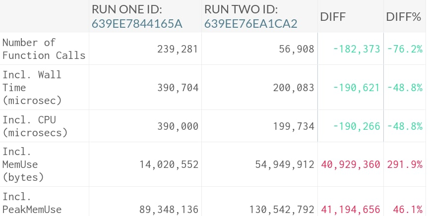

# 2. Configuration

## Table of contents

1.  [Installation and Setup](1.Installation-and-Setup.md)
2.  [Configuration](2.Configuration.md)
3.  [Usage](3.Usage.md)
4.  [FAQ](4.FAQ.md)

See [Config](https://github.com/ulcuber/LogViewer/blob/v9.x/config/log-viewer.php)

### Large files

At first, you can see peak memory usage and memory limit in footer

For too large files there is `max_log_size` setting in config. It will exclude files larger than supplied value in bytes

If you do not want to exclude big files but have `Allowed memory size of n bytes exhausted` error than use `chunked_size_threshold` setting. It allows to read files larger than supplied value in bytes via generators internally using SplFileObject::fgets calls

If log-viewer works too slow after applying `chunked_size_threshold` than consider increasing **php.ini** `memory_limit`

**TLDR;** You would balance between CPU and memory consumption



Also, you can include or exclude log files in `pattern`.`prefix` using glob syntax (not regex):

```php
'pattern' => [
    'prefix'    => '{laravel,service-guzzle}-',
    'date'      => Filesystem::PATTERN_DATE,      // '[0-9][0-9][0-9][0-9]-[0-9][0-9]-[0-9][0-9]'
    'extension' => Filesystem::PATTERN_EXTENSION, // '.log'
],
```
